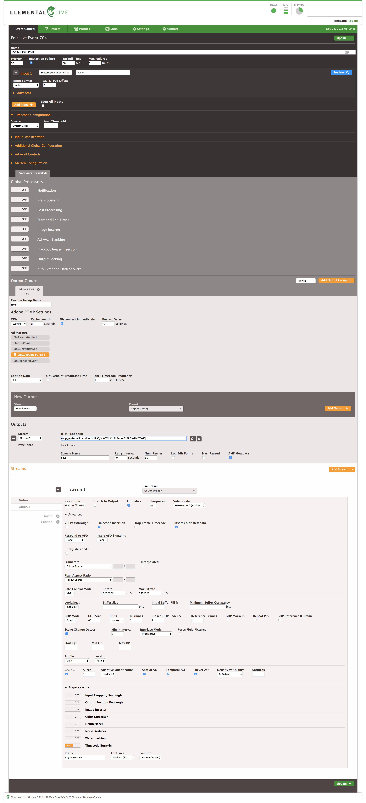
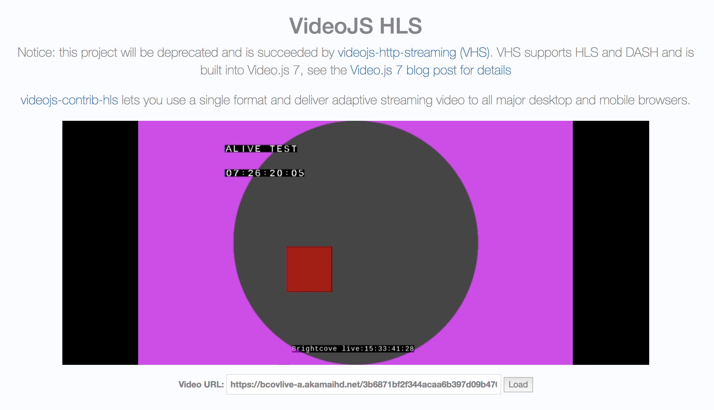
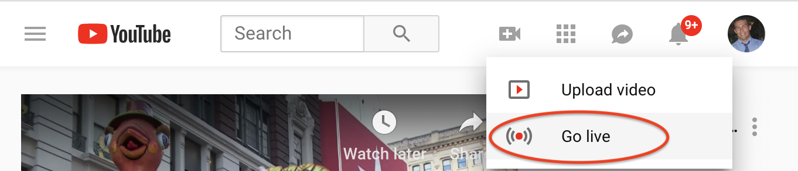
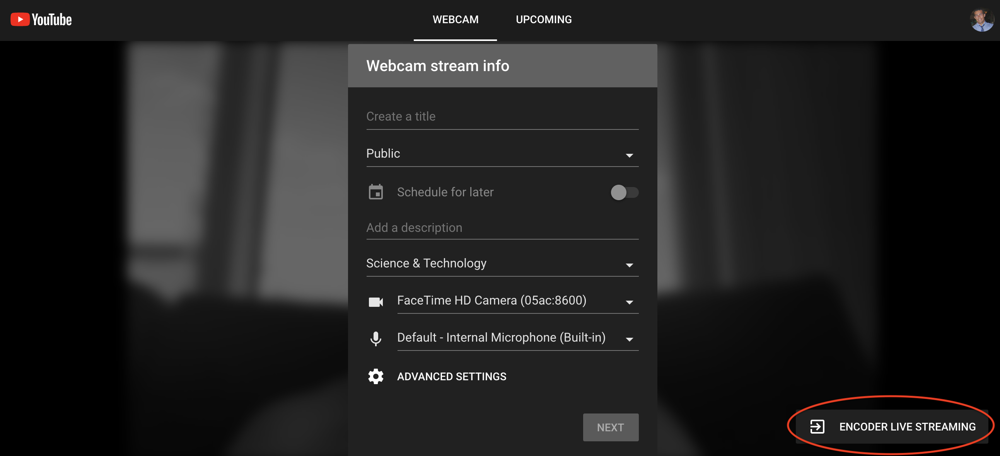
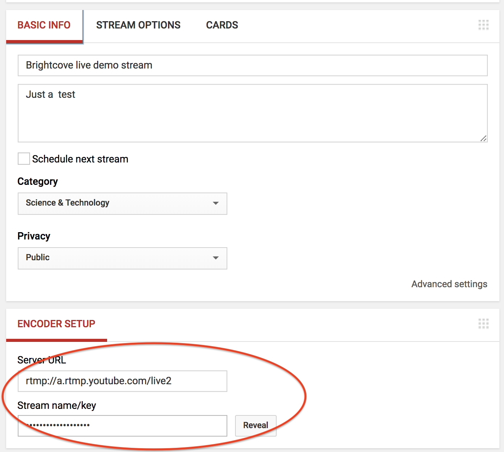
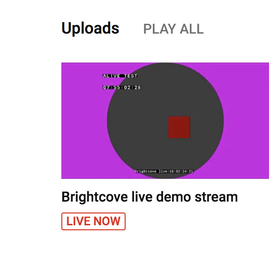
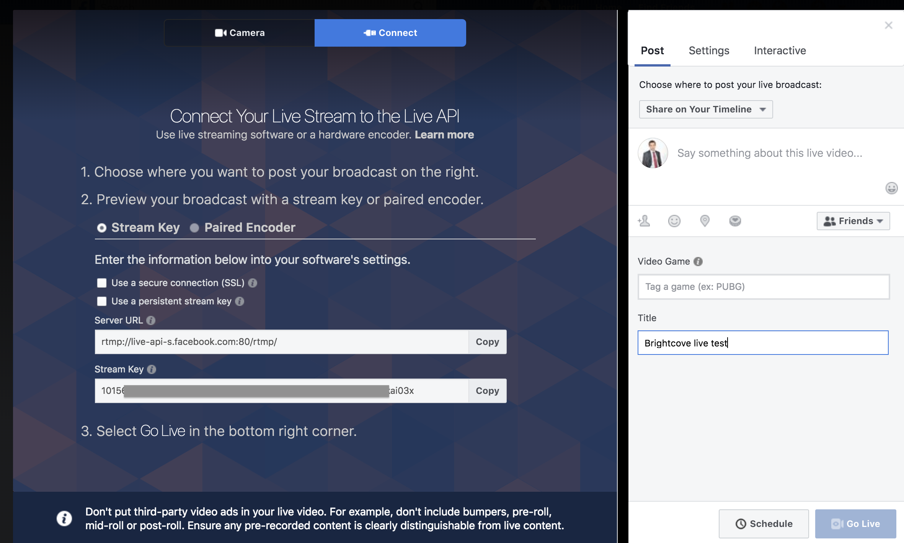
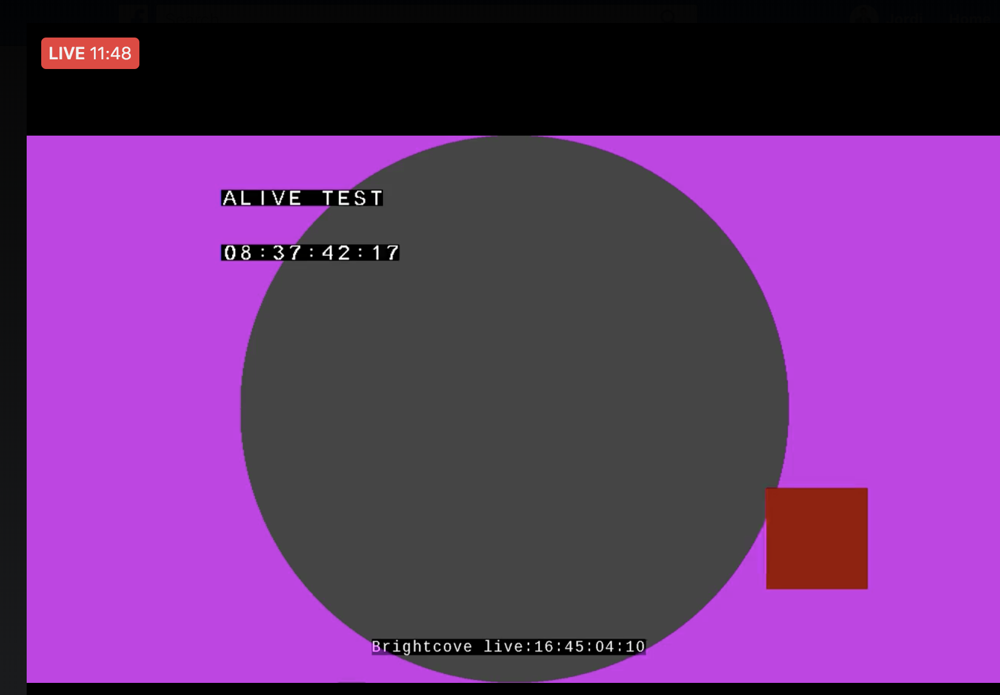

# brightcove-live-demo-srt-rtmpout-fac

TODO PICTURE

# Introduction
This repo explains at API level how to create a live streaming job in [Brightcove live](https://www.brightcove.com/en/live) and take advantage of some of the advaced features this platform offers, such as:
- [RTMP](https://en.wikipedia.org/wiki/Real-Time_Messaging_Protocol) outputs (you can re stream live to social media) 
- Frame accurate clipping based on SMPTE Time code

## Create a live job
- We assume you already have a brightcove acount and they you have your API-KEY, let's call it `bcov-live-api-key`
- You need to create the following requests with [curl](https://curl.haxx.se/)

```
curl -X POST \
  https://api.bcovlive.io/v1/jobs \
  -H 'Content-Type: application/json' \
  -H 'x-api-key: {{bcov-live-api-key}}' \
  -d '{
    "live_stream": true,
    "region": "{{closest-region-encoder}}",
    "outputs": [{
        "label": "hls360p",
        "live_stream": true,
        "height": 360,
        "video_bitrate": 365,
        "segment_seconds": 6,
        "keyframe_interval": 60
   },
   {
        "label": "hls432p",
        "live_stream": true,
        "height": 432,
        "video_bitrate": 730,
        "segment_seconds": 6,
        "keyframe_interval": 60
   },
   {
        "label": "hls540p",
        "live_stream": true,
        "height": 540,
        "video_bitrate": 2000,
        "segment_seconds": 6,
        "keyframe_interval": 60
   },
   {
        "label": "hls720p3M",
        "live_stream": true,
        "height": 540,
        "video_bitrate": 2000,
        "segment_seconds": 6,
        "keyframe_interval": 60
   },
   {
        "label": "hls720p4.5M",
        "live_stream": true,
        "height": 540,
        "video_bitrate": 4500,
        "segment_seconds": 6,
        "keyframe_interval": 60
   }]
}'
```
**Replace:**
- `{{closest-region-encoder}}` for the closest available region to your encoder, see [closest available regions](https://support.brightcove.com/overview-brightcove-live-api#Support_aws_regions) to your encoder. For instance: `us-west-2`
- `{{bcov-live-api-key}}` for your Brightcove live API key. For instance: `abcdefgaVANBYUJKSDJ2342343212345`

The response should be something like this:
```
{
    "id": "3b6871bf2f344acaa6b397d09b476018",
    "outputs": [... removed for simplicity ...],
    "stream_url": "rtmp://ep1-usw2.bcovlive.io:1935/3b6871bf2f344acaa6b397d09b476018",
    "stream_name": "alive",
    "static": false,
    "encryption": {},
    "playback_url": "https://bcovlive-a.akamaihd.net/3b6871bf2f344acaa6b397d09b476018/us-west-2/NA/playlist.m3u8",
    "playback_url_dvr": "https://bcovlive-a.akamaihd.net/3b6871bf2f344acaa6b397d09b476018/us-west-2/NA/playlist_dvr.m3u8"
}
```

This jobs will create 5 renditions **based** on [Apple recommendations](https://developer.apple.com/documentation/http_live_streaming/hls_authoring_specification_for_apple_devices).

## Configure your encoder
In this case we'll use a [Elemental live box](https://www.elemental.com/products/aws-elemental-live) encoder.
The most imporant point for this tests are:
- Configure timecode source as "system clock"
- Set "OnFi timecode frequency" to 1
- Check "time code insertion" inside video
- Strongly recommended Framerate = follow source

This is the config we used for this experiment:


## Test playback
You can use [VideoJS HLS demo page](https://videojs.github.io/videojs-contrib-hls/) to test playback, just paste the value "playback_url" returned in the creation job response. See next picture.


## Add the live stream to Youtube live
It is assumend you have a Youtube account enabled for live streaming.
- Click "go live", see:

- Click on "Encoder live streaming":

- Configure your live event Youtube metadata and use the "Encoder set up data to connect the Brightcove live stream to Youtube

- Create live output for Brightcove live job using "encoder setup" settings:
```
curl -X POST \
  https://api.bcovlive.io/v1/jobs/{{bcov-live-job-id}}/rtmpouts \
  -H 'Content-Type: application/json' \
  -H 'x-api-key: {{bcov-live-api-key}}' \
  -d '{        
  "url": "rtmp://a.rtmp.youtube.com/live2/{{youtube-secret-stream-name}}"
}'
```
**Replace:**
- `{{bcov-live-job-id}}` for your Brightcove live API key. In out example this value should be `3b6871bf2f344acaa6b397d09b476018`
- `{{bcov-live-api-key}}` for your Brightcove live API key. For instance: `abcdefgaVANBYUJKSDJ2342343212345`
- `{{youtube-secret-stream-name}}` for you stream name / key that Youtube gives you

The response should be something like this:
```
{
    "connection_info": {
        "host": "a.rtmp.youtube.com",
        "port": 1935,
        "application": "live2",
        "streamName": "{{youtube-secret-stream-name}}"
    },
    "duration_history": [],
    "rtmp_out_id": "27aacdfa5bcf4436ade0519e6a748aba",
    "stream_start": 1542902218238
}
```

- Finally to test Youtube playback you can go to Youtube my channel


## Add the live stream to Facebook live
It is assumend you have a Facebook account enabled for live streaming.
- Just click "Live video"
- Click "connect" and stream key to get the data needed to connect your Brightcove live job, see:

- Create live output for Brightcove live job using "server url" and "stream key" from Facebook:
```
curl -X POST \
  https://api.bcovlive.io/v1/jobs/{{bcov-live-job-id}}/rtmpouts \
  -H 'Content-Type: application/json' \
  -H 'x-api-key: {{bcov-live-api-key}}' \
  -d '{        
  "url": "rtmp://live-api-s.facebook.com:80/rtmp/{{facebook-secret-stream-name}}"
}'
```

The response should be something like this:
```
{
    "connection_info": {
        "host": "live-api-s.facebook.com",
        "port": 80,
        "application": "rtmp",
        "streamName": "{{facebook-secret-stream-name}}"
    },
    "duration_history": [],
    "rtmp_out_id": "59323c3d1e2b44748755853193fb126c",
    "stream_start": 1542904101097
}
```

- The last step is just to click "Go Live" and test Facebook live playback



**Replace:**
- `{{bcov-live-job-id}}` for your Brightcove live API key. In out example this value should be `3b6871bf2f344acaa6b397d09b476018`
- `{{bcov-live-api-key}}` for your Brightcove live API key. For instance: `abcdefgaVANBYUJKSDJ2342343212345`
- `{{facebook-secret-stream-name}}` for you stream name that Facebook gives you

# References
- [Brightcove live API reference](https://docs.brightcove.com/live-api/v1/doc/index.html)

# TODOs
- Create FAC highlights!!!!
- Add [SRT](https://www.srtalliance.org/about-github/) ingest.  *Remember SRT is based on UDP bidirectional communication*, your firewall / router needs to be configured properly and allow UDP outputs from the encoder (caller) and UDP back from the internet on the same port
