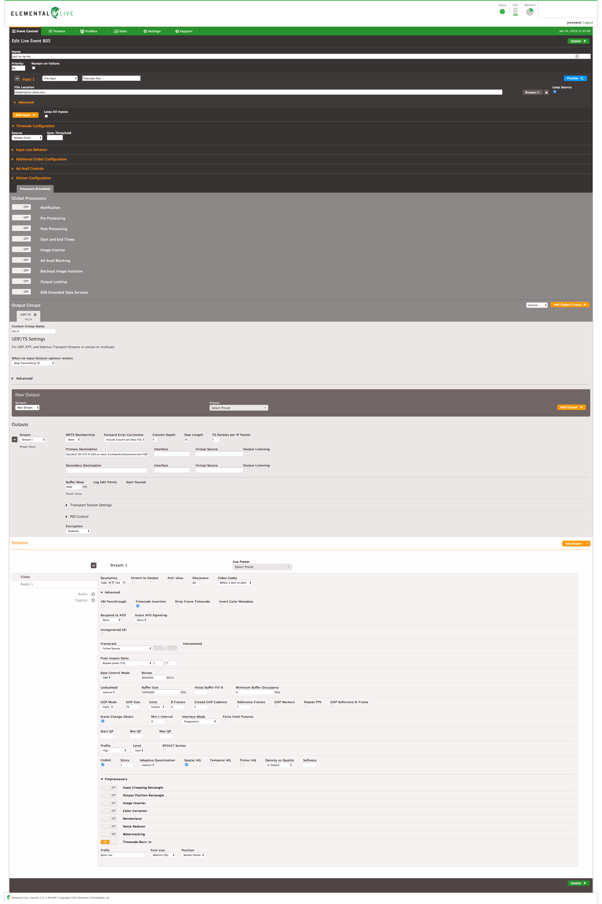

# brightcove-live-demo-srt-rtmpout-fac


# Introduction
This repo explains at API level how to create a live streaming job in [Brightcove live](https://www.brightcove.com/en/live) and take advantage of some of the advaced features this platform offers, such as:
- [RTMP](https://en.wikipedia.org/wiki/Real-Time_Messaging_Protocol) outputs (you can re stream live to social media) 
- Frame accurate clipping based on SMPTE Time code

## Create a live job
- We assume you already have a brightcove acount and they you have your API-KEY, let's call it `bcov-live-api-key`
- You need to create the following requests with [curl](https://curl.haxx.se/)

### RTMP input
You can use this job request:
```
curl -X POST \
  https://api.bcovlive.io/v1/jobs \
  -H 'Content-Type: application/json' \
  -H 'x-api-key: {{bcov-live-api-key}}' \
  -d '{
    "live_stream": true,
    "region": "{{closest-region-encoder}}",
    "outputs": [{
        "label": "hls360p",
        "live_stream": true,
        "height": 360,
        "video_bitrate": 365,
        "segment_seconds": 6,
        "keyframe_interval": 60
   },
   {
        "label": "hls432p",
        "live_stream": true,
        "height": 432,
        "video_bitrate": 730,
        "segment_seconds": 6,
        "keyframe_interval": 60
   },
   {
        "label": "hls540p",
        "live_stream": true,
        "height": 540,
        "video_bitrate": 2000,
        "segment_seconds": 6,
        "keyframe_interval": 60
   },
   {
        "label": "hls720p3M",
        "live_stream": true,
        "height": 540,
        "video_bitrate": 2000,
        "segment_seconds": 6,
        "keyframe_interval": 60
   },
   {
        "label": "hls720p4.5M",
        "live_stream": true,
        "height": 540,
        "video_bitrate": 4500,
        "segment_seconds": 6,
        "keyframe_interval": 60
   }]
}'
```

### TS + FEC (SMPTE 2022)
*This communications is based on UDP unidirectional communication (encoder to live platform)*, your firewall / router needs to be configured properly and allow UDP outputs from the encoder to the internet from the encoder's IP.

You also have to take into account FEC information is sent on different ports than the media. So if you are using port 2000 for media you also need to open 2002 and 2004 (if you are using 2D FEC).

Job request for TS + FEC:
```
curl -X POST \
  https://api.bcovlive.io/v1/jobs \
  -H 'Content-Type: application/json' \
  -H 'x-api-key: {{bcov-live-api-key}}' \
  -d '{
    "live_stream": true,
    "region": "us-west-2",
    "protocol": "rtp-fec",
    "cidr_whitelist": ["{{MiEncoderIPRange}}", "{{MiBackupEncoderIPRange}}"],
    "outputs": [{
        "label": "hls360p",
        "live_stream": true,
        "height": 360,
        "video_bitrate": 365,
        "segment_seconds": 6,
        "keyframe_interval": 60
   },
   {
        "label": "hls432p",
        "live_stream": true,
        "height": 432,
        "video_bitrate": 730,
        "segment_seconds": 6,
        "keyframe_interval": 60
   },
   {
        "label": "hls540p",
        "live_stream": true,
        "height": 540,
        "video_bitrate": 2000,
        "segment_seconds": 6,
        "keyframe_interval": 60
   },
   {
        "label": "hls720p3M",
        "live_stream": true,
        "height": 540,
        "video_bitrate": 2000,
        "segment_seconds": 6,
        "keyframe_interval": 60
   },
   {
        "label": "hls720p4.5M",
        "live_stream": true,
        "height": 720,
        "video_bitrate": 4500,
        "segment_seconds": 6,
        "keyframe_interval": 60
   }]
}'
```
### SRT
*Remember [SRT](https://www.srtalliance.org/about-github/) is based on UDP bidirectional communication*, your firewall / router needs to be configured properly and allow UDP outputs from the encoder's IP (caller) and UDP back from the internet on the same port

Job request for [SRT](https://www.srtalliance.org/about-github/):
```
curl -X POST \
  https://api.bcovlive.io/v1/jobs \
  -H 'Content-Type: application/json' \
  -H 'x-api-key: {{bcov-live-api-key}}' \
  -d '{
    "live_stream": true,
    "region": "us-west-2",
    "protocol": "srt",
    "cidr_whitelist": ["{{MiEncoderIPRange}}", "{{MiBackupEncoderIPRange}}"],
    "outputs": [{
        "label": "hls360p",
        "live_stream": true,
        "height": 360,
        "video_bitrate": 365,
        "segment_seconds": 6,
        "keyframe_interval": 60
   },
   {
        "label": "hls432p",
        "live_stream": true,
        "height": 432,
        "video_bitrate": 730,
        "segment_seconds": 6,
        "keyframe_interval": 60
   },
   {
        "label": "hls540p",
        "live_stream": true,
        "height": 540,
        "video_bitrate": 2000,
        "segment_seconds": 6,
        "keyframe_interval": 60
   },
   {
        "label": "hls720p3M",
        "live_stream": true,
        "height": 540,
        "video_bitrate": 2000,
        "segment_seconds": 6,
        "keyframe_interval": 60
   },
   {
        "label": "hls720p4.5M",
        "live_stream": true,
        "height": 720,
        "video_bitrate": 4500,
        "segment_seconds": 6,
        "keyframe_interval": 60
   }]
}'
```

**Replace:**
- `{{closest-region-encoder}}` for the closest available region to your encoder, see [closest available regions](https://support.brightcove.com/overview-brightcove-live-api#Support_aws_regions) to your encoder. For instance: `us-west-2`
- `{{bcov-live-api-key}}` for your Brightcove live API key. For instance: `abcdfeg-this-is-a-fake-api-key-FgJajjasd12hJHsZ`
- (For TS+FEC) `{{MiEncoderIPRange}}` and `{{MiBackupEncoderIPRange}}`, those looks like: `1.2.3.4/32`

The response should be something like this for RTMP:
```
{
    "id": "3b6871bf2f344acaa6b397d09b476018",
    "outputs": [... removed for simplicity ...],
    "stream_url": "rtmp://ep1-usw2.bcovlive.io:1935/3b6871bf2f344acaa6b397d09b476018",
    "stream_name": "alive",
    "static": false,
    "encryption": {},
    "playback_url": "https://bcovlive-a.akamaihd.net/3b6871bf2f344acaa6b397d09b476018/us-west-2/NA/playlist.m3u8",
    "playback_url_dvr": "https://bcovlive-a.akamaihd.net/3b6871bf2f344acaa6b397d09b476018/us-west-2/NA/playlist_dvr.m3u8"
}
```

This is a example response for TS+FEC:
```
{
    "id": "42c913e5373844a99a6285367f2704ec",
    "outputs": [... removed for simplicity ...],
    "stream_url": "rtp://ec2-34-212-0-224.us-west-2.compute.amazonaws.com:12675",
    "stream_name": "42c913e5373844a99a6285367f2704ec.stream",
    "static": false,
    "encryption": {},
    "playback_url": "https://bcovlive-a.akamaihd.net/42c913e5373844a99a6285367f2704ec/us-west-2/NA/playlist.m3u8",
    "playback_url_dvr": "https://bcovlive-a.akamaihd.net/42c913e5373844a99a6285367f2704ec/us-west-2/NA/playlist_dvr.m3u8"
}
```

Example response for SRT:
```
{
    "id": "cdb820f2d7764b91a79536dac799fb77",
    "outputs": [... removed for simplicity ...],
    "stream_url": "srt://ec2-34-212-0-224.us-west-2.compute.amazonaws.com:13820",
    "stream_name": "cdb820f2d7764b91a79536dac799fb77.stream",
    "static": false,
    "encryption": {},
    "playback_url": "https://bcovlive-a.akamaihd.net/cdb820f2d7764b91a79536dac799fb77/us-west-2/NA/playlist.m3u8",
    "playback_url_dvr": "https://bcovlive-a.akamaihd.net/cdb820f2d7764b91a79536dac799fb77/us-west-2/NA/playlist_dvr.m3u8"
}
```

This jobs will create 5 renditions **based** on [Apple recommendations](https://developer.apple.com/documentation/http_live_streaming/hls_authoring_specification_for_apple_devices).

## Configure your encoder
For RTMP input test We'll use a [Elemental live box](https://www.elemental.com/products/aws-elemental-live) encoder.
The most imporant point for this tests are:
- Configure timecode source as "system clock"
- Set "OnFi timecode frequency" to 1
- Check "time code insertion" inside video
- Strongly recommended Framerate = follow source

This is the config we used for RTMP input:


For TS+FEC input test we'll use same elemental encoder [Elemental live box](https://www.elemental.com/products/aws-elemental-live) encoder.
The most imporant point for this tests are:
- Configure timecode source as "system clock"
- Set "Forward error correction" to "Column and Row" and set "Column Depth" and "Row length" values:
    - Colunm depth: It means 1 extra FEC packet will be added every "Column Depth" TS packets.
    - Row length: It means 1 extra FEC packet will be added every "Row length" TS packets.
    - Additional data added can be calculated: TotalBitrate = MediaBitrate * (1/(ColumnDepth + 1) + 1/(RowLength + 1)
- Check "time code insertion" inside video
- Strongly recommended Framerate = follow source

This is the config we used for TS+FEC input:



This is the configuration we used for SRT in a [Haivision KB](https://www.haivision.com/products/kb-series/):


## Test playback
You can use [VideoJS HLS demo page](https://videojs.github.io/videojs-contrib-hls/) to test playback, just paste the value "playback_url" returned in the creation job response. See next picture.


## Add the live stream to Youtube live
It is assumed you have a Youtube account enabled for live streaming.
- Click "go live", see:

- Click on "Encoder live streaming":

- Configure your live event Youtube metadata and use the "Encoder set up" data to connect the Brightcove live stream to Youtube

- Create live output for Brightcove live job using "encoder setup" settings:
```
curl -X POST \
  https://api.bcovlive.io/v1/jobs/{{bcov-live-job-id}}/rtmpouts \
  -H 'Content-Type: application/json' \
  -H 'x-api-key: {{bcov-live-api-key}}' \
  -d '{        
  "url": "rtmp://a.rtmp.youtube.com/live2/{{youtube-secret-stream-name}}"
}'
```
**Replace:**
- `{{bcov-live-job-id}}` for your Brightcove live API key. In out example this value should be `3b6871bf2f344acaa6b397d09b476018`
- `{{bcov-live-api-key}}` for your Brightcove live API key. For instance: `abcdfeg-this-is-a-fake-api-key-FgJajjasd12hJHsZ`
- `{{youtube-secret-stream-name}}` for the stream name / key that Youtube provides

The response should be something like this:
```
{
    "connection_info": {
        "host": "a.rtmp.youtube.com",
        "port": 1935,
        "application": "live2",
        "streamName": "{{youtube-secret-stream-name}}"
    },
    "duration_history": [],
    "rtmp_out_id": "27aacdfa5bcf4436ade0519e6a748aba",
    "stream_start": 1542902218238
}
```

- Finally to test Youtube playback you can go to Youtube my channel


## Add the live stream to Facebook live
It is assumed you have a Facebook account enabled for live streaming.
- Just click "Live video"
- Click "connect" and stream key to get the data needed to connect your Brightcove live job, see:

- Create live output for Brightcove live job using "server url" and "stream key" from Facebook:
```
curl -X POST \
  https://api.bcovlive.io/v1/jobs/{{bcov-live-job-id}}/rtmpouts \
  -H 'Content-Type: application/json' \
  -H 'x-api-key: {{bcov-live-api-key}}' \
  -d '{        
  "url": "rtmp://live-api-s.facebook.com:80/rtmp/{{facebook-secret-stream-name}}"
}'
```
**Replace:**
- `{{bcov-live-job-id}}` for your Brightcove live API key. In out example this value should be `3b6871bf2f344acaa6b397d09b476018`
- `{{bcov-live-api-key}}` for your Brightcove live API key. For instance: `abcdfeg-this-is-a-fake-api-key-FgJajjasd12hJHsZ`
- `{{facebook-secret-stream-name}}` for you stream name that Facebook gives you

The response should be something like this:
```
{
    "connection_info": {
        "host": "live-api-s.facebook.com",
        "port": 80,
        "application": "rtmp",
        "streamName": "{{facebook-secret-stream-name}}"
    },
    "duration_history": [],
    "rtmp_out_id": "59323c3d1e2b44748755853193fb126c",
    "stream_start": 1542904101097
}
```

- The last step is just to click "Go Live" on Facebook webpage and test Facebook live playback


## Create a **frame accurate** clip based on SMPTE TC
It is assumed you have an AWS account.
- Create the destination S3 bucket and configure the credentials (you just need to to that once):
     - Create an S3 bucket and a AWS IAM user with write rights to that bucket, see [create s3 bukcet](https://docs.aws.amazon.com/quickstarts/latest/s3backup/step-1-create-bucket.html), [create IAM user](https://docs.aws.amazon.com/IAM/latest/UserGuide/id_users_create.html), [set IAM user rights to access S3 folders](https://aws.amazon.com/premiumsupport/knowledge-center/iam-s3-user-specific-folder/)
     - Get AWS access ID and SECRET for that user and add those as s3 credential to Brighcove live with the following command:
```
curl -X POST \
  https://api.bcovlive.io/v1/credentials \
  -H 'Content-Type: application/json' \
  -H 'x-api-key: {{bcov-live-api-key}}' \
  -d '{
  "credential_default_for_type": false,
  "credential_label": "AWS-TEST-S3-UPLOADS",
  "credential_private": "{{aws-iam-user-id}}",
  "credential_public": "{{aws-iam-user-secret}}",
  "credential_type": "s3"
}'
```
**Replace:**
- `{{bcov-live-api-key}}` for your Brightcove live API key. For instance: `abcdfeg-this-is-a-fake-api-key-FgJajjasd12hJHsZ`
- `{{aws-iam-user-id}}` and `{{aws-iam-user-secret}}` for the values provided by AWS

The response should be something like this:
```
{"credential_id":"296f44cb4fb54ef7a828ba0a60512cd2","user_id":"666f23e01f57441890650a97dc189301","credential_label":"AWS-TEST-S3-UPLOADS"}
```

- Create the following request that will create the clip and upload it to your S3 bucket:
```
curl -X POST \
  https://api.bcovlive.io/v1/vods \
  -H 'Content-Type: application/json' \
  -H 'x-api-key: {{bcov-live-api-key}}' \
  -d '{
    "live_job_id":"{{bcov-live-job-id}}",
    "outputs":[{
        "label": "Trim by SMPTE TC 17:33:11:12 to 17:34:00:00",
    	"stream_start_timecode": "{{timecode-in}}",
    	"stream_end_timecode": "{{timecode-out}}",
        "url":"s3://jordi-test/clipping-test/smpte_tc_1542910526.mp4",
        "credentials": "AWS-TEST-S3-UPLOADS"
    }]
}'
```
**Replace:**
- `{{bcov-live-api-key}}` for your Brightcove live API key. For instance: `abcdfeg-this-is-a-fake-api-key-FgJajjasd12hJHsZ`
- `{{bcov-live-job-id}}` for your Brightcove live API key. In out example this value should be `3b6871bf2f344acaa6b397d09b476018`
- `{{timecode-in}}` and `{{timecode-out}}` should be values that make sense (present) in your live stream. In our example we have used: `17:33:11:12` and `17:34:00:00`

The response should be something like this:
```
{
    "vod_jobs": [
        {
            "jvod_id": "0b14a4ba326d4dd08f15053ca2a403b7",
            "label": "Trim by SMPTE TC 17:33:11:12 to 17:34:00:00"
        }
    ],
    "live_job_id": "3b6871bf2f344acaa6b397d09b476018"
}
```
- To test the accuracy of the experiment we downloaded the clip and used [Adobe premiere](https://www.adobe.com/products/premiere.html) to checked the 1st and last frame, since the timecode is overlayed a simple visual check is enough to confirm the accuracy at input and output points:


Note: We can use [AWS lambdas](https://aws.amazon.com/lambda/) and [AWS Lambdas step functions](https://aws.amazon.com/step-functions/) to automate any kind of VOD publishing process based on the event trigered by S3 PUT.

# References
- [Brightcove live API reference](https://docs.brightcove.com/live-api/v1/doc/index.html)
